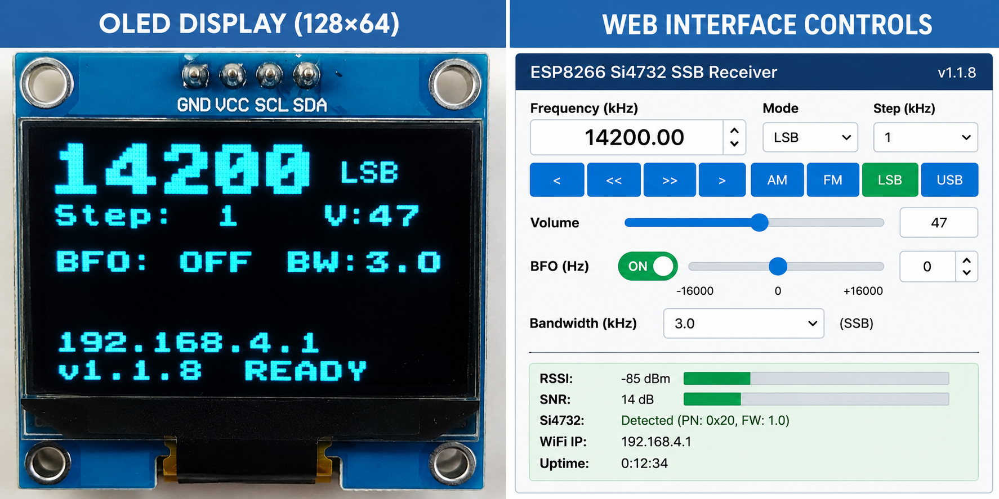

# ESP8266-Si4732-SSB-Receiver

**ESP8266 Si4732 SSB HF Receiver — firmware v1.3.0**

A compact **ESP8266 + Si4732 HF receiver** with AM/FM/LSB/USB operation, rotary tuning, OLED status display, EEPROM memories, and a browser-based Web Control Interface.

**Current documented firmware:** v1.3.0

## Highlights

- Si4732-based AM/FM/SSB receiver
- AM, FM, LSB and USB modes
- Rotary encoder tuning with selectable step size
- 10 EEPROM memory channels with frequency/mode display
- Web STORE / RECALL memory controls
- Volume and MUTE controls
- BFO ON/OFF with centred ±16 kHz slider
- AM/SSB bandwidth selection
- RSSI/SNR and receiver status in the Web Interface
- RESET control intentionally removed from the Web Interface
- OLED layout frozen and documented
- Wi-Fi Web Interface supports **AP mode and STA mode**
- WiFiManager configuration for connecting the receiver to a local network
- Automatic STA reconnect with AP fallback

## Wi-Fi operation

The default configuration is AP-first. The receiver creates its own network and the Web Interface is available at `192.168.4.1`.

For a larger-screen setup, STA mode can be selected in `Config.h`. In STA mode the receiver joins an existing Wi-Fi network and the OLED shows the assigned IP address.

WiFiManager is available when credentials are not available or when network configuration is required. After successful configuration the receiver can operate in STA mode; if the network is unavailable it falls back to AP mode.

See [Wi-Fi Modes](docs/WIFI_MODES.md).

## Web Control Interface

The Web Interface provides:

- Frequency and mode display
- Step and tuning controls
- AM / FM / LSB / USB selection
- Volume slider
- MUTE control
- BFO ON/OFF and BFO slider
- Bandwidth selection
- Dedicated Web Control BAND - / BAND + controls
- Memory dropdown showing **memory number + stored frequency + mode**, so the user does not have to guess what each memory contains
- STORE and RECALL controls
- WiFi Manager
- Receiver status, RSSI, SNR, IP and uptime

The RESET control is intentionally absent.

## OLED display

The OLED layout is frozen as follows:

- Rows 0–1: Frequency + Mode
- Row 2: Step + Volume
- Row 3: BFO + Bandwidth
- Rows 4–5: blank / cleared
- Row 6: Web Interface IP address
- Row 7: Firmware version + status

SSID, RSSI, SNR and Band are not displayed on the OLED.

## Memory operation

The Web Interface memory selector identifies each channel, for example:

- `M1 — 7.074 MHz LSB`
- `M2 — 14.200 MHz USB`
- `M3 — Empty`

Select a channel, then use **STORE** to save the current receiver state or **RECALL** to restore it.

## Build

Open `ESP8266-Si4732-SSB-Receiver.ino` in Arduino IDE with the ESP8266 core installed. Install the libraries listed in the source/header documentation, configure `Config.h` if required, select the correct ESP8266 board and upload.

## Documentation

- [Hardware](docs/HARDWARE.md)
- [OLED and Web Interface](docs/OLED_AND_WEB_INTERFACE.md)
- [Wi-Fi Modes](docs/WIFI_MODES.md)
- [Web API](docs/WEB_API.md)
- [Project Structure](docs/PROJECT_STRUCTURE.md)
- [Feature Roadmap](docs/FEATURE_ROADMAP.md)
- [User Manual](docs/User_Manual.docx)

## Project status

v1.3.0 is the current documented baseline. The OLED presentation is frozen. Future development should add features without changing the agreed OLED layout unless explicitly requested.

## License

See [LICENSE](LICENSE). The repository also contains third-party components whose original licenses must be respected.

## GitHub release baseline

This repository is the v1.3.0 documented baseline of the project. The OLED presentation is intentionally frozen; future changes should preserve it unless explicitly requested.

**Suggested initial commit message:**

`Initial release: ESP8266-Si4732-SSB-Receiver v1.2.8`
